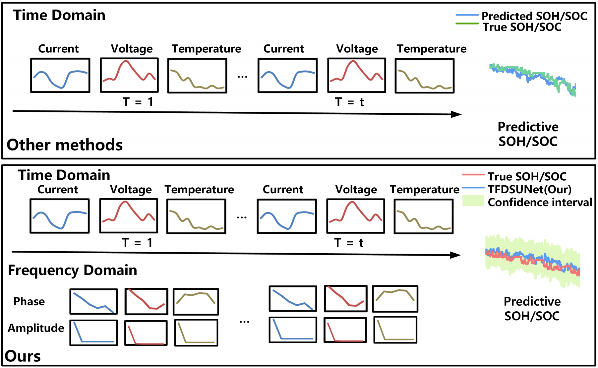
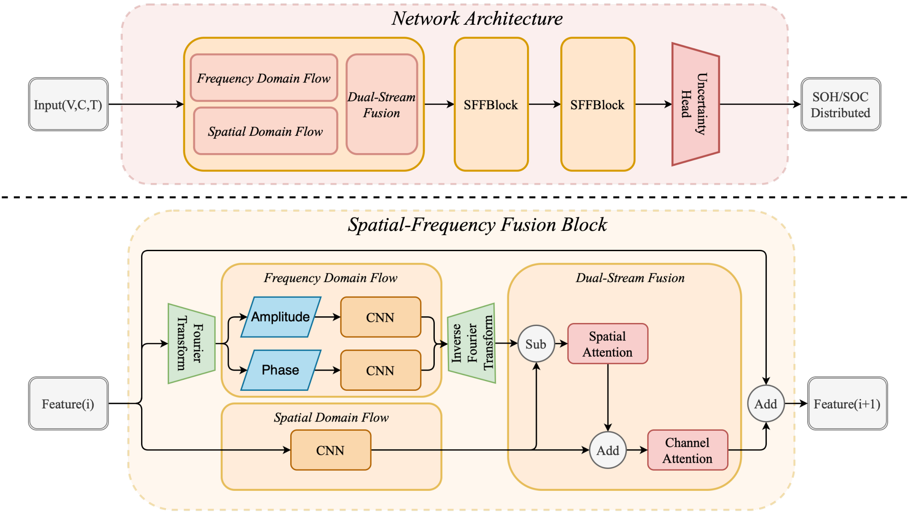

# TFDSUNet: Time-Frequency Dual-Stream Uncertainty Network for Battery SOH/SOC Prediction
[`Wenzhe Xiao`](https://gr.xjtu.edu.cn/en/web/caoxiangyong/home), and [`Zeyu Zhu`](https://scholar.google.com/citations?hl=zh-CN&view_op=list_works&gmla=ABEO0Ypgw7n86h8mMjkhHVfmhMuPPgnO7C4NT-RWQ_lB1xSqtIWcyPqrPOsxI7ffxZ-amtiKK7KVFRnx_ZOPxFYH2-iKKLY&user=X3CisOwAAAAJ)


## Our Insight
<p align="center">
  
</p>
The sequence of current, voltage and temperature presents a strong periodicity during battery discharge. Existing data-driven methods often only explore feature extraction in the time domain. However, the invariance and variability in the frequency domain are better data structures for data extraction.And the local feature extraction in the frequency domain corresponds to the global extraction in the time domain. Our method can also be regarded as a global information supplement to the local feature extraction in the time domain.

## Implementation of TFDSUNet
<p align="center">
  
</p>
The implementation of TFDSUNet is in `model`, including uncertainty head, frequency domain flow, spatial domain flow and dual-stream flow.

## Setting up a virtual conda environment
Setup a virtual conda environment using the provided ``requirements.txt``.
```
conda create --name TFDSUNet --file requirements.txt
conda activate TFDSUNet
```

## Other Codes
Data preprocessing, dataloader and metrics(MSE and RMSR) are implemented in `utils`.

## Result on LG Datasets
Pre-trained models on 0 degree and 10 degree datasets are saved in `result/0degree` and `result/10degree`, respectively.

## Datasets
Datasets can be found in [`CALCE`](https://calce.umd.edu/battery-data#Citations) and [`LG`](https://data.mendeley.com/datasets/cp3473x7xv/3)